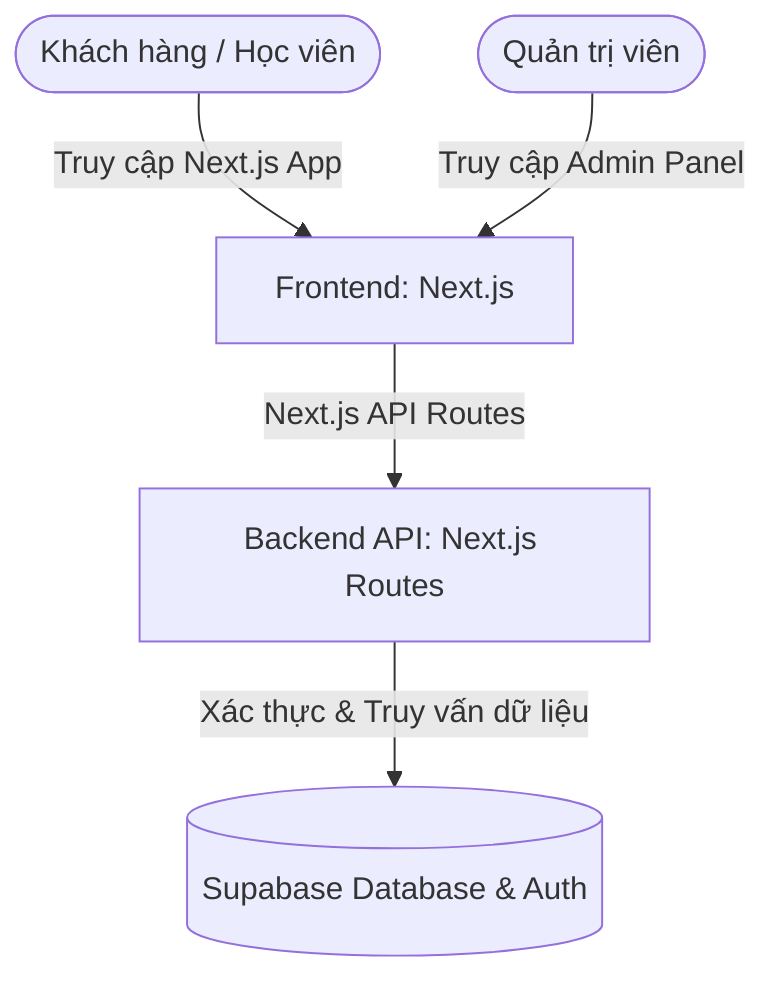

# 00. Overview - SonBarber Website

## Project Overview
Dự án xây dựng hệ thống website giới thiệu thương hiệu **Sơn Barber** tại Nghệ An. Website đóng vai trò là bộ mặt số của thương hiệu, tích hợp giới thiệu dịch vụ barber shop, bán sản phẩm chuyên dụng, đào tạo học viên và hệ thống quản trị admin.

### Mục tiêu dự án
1. **Brand Identity:** Giới thiệu về thương hiệu Sơn Barber và câu chuyện của Founder Nguyễn Thái Sơn.
2. **Barber Shop (Dịch vụ + Sản phẩm):** Trưng bày dịch vụ cắt tóc, tạo kiểu, hóa chất và các nhóm sản phẩm chăm sóc tóc, dụng cụ ngành tóc.
3. **Academy (Đào tạo):** Trưng bày và tuyển sinh các khóa học đào tạo nghề barber chuyên nghiệp.
4. **Hệ thống Quản trị (Admin Panel):** Quản lý dịch vụ, sản phẩm, khóa học, đơn đăng ký học, đánh giá khách hàng, thư viện ảnh và blog bài viết.

---

## Đối tượng khách hàng & Người dùng
* **Khách hàng vãng lai / Khách quen:** Tìm kiếm thông tin dịch vụ, bảng giá của các cơ sở, xem sản phẩm, kiểu tóc đẹp và đặt lịch hẹn cắt tóc.
* **Học viên tiềm năng:** Tìm kiếm cơ hội học nghề, xem thông tin chi tiết các khóa học và đăng ký tham gia khóa học trực tuyến.
* **Quản trị viên (Admin):** Founder và quản lý hệ thống cập nhật nội dung website, xử lý đăng ký và kiểm duyệt thông tin.

---

## Phong cách Thiết kế & Định hướng Mỹ thuật
* **Giao diện Người dùng (UI User):** Phong cách **Black & Gold Luxury** kết hợp **Premium Barber Vibe** (nền tối sâu, typography serif cổ điển, điểm nhấn vàng kim sang trọng).
* **Giao diện Quản trị (UI Admin):** Phong cách **White & Blue Admin Style** (nền sáng thanh lịch, gọn gàng, trực quan cho công việc vận hành).

---

## Kiến trúc Hệ thống (System Architecture)

### Chi tiết Công nghệ
* **Frontend:** Next.js (phát triển dạng module, sạch sẽ, tối ưu hóa SEO và GEO).
* **Backend:** Next.js API Routes.
* **Database & Authentication:** Supabase.
* **Tích hợp bên ngoài:** EasySalon (Hệ thống đặt lịch chuyên dụng).
