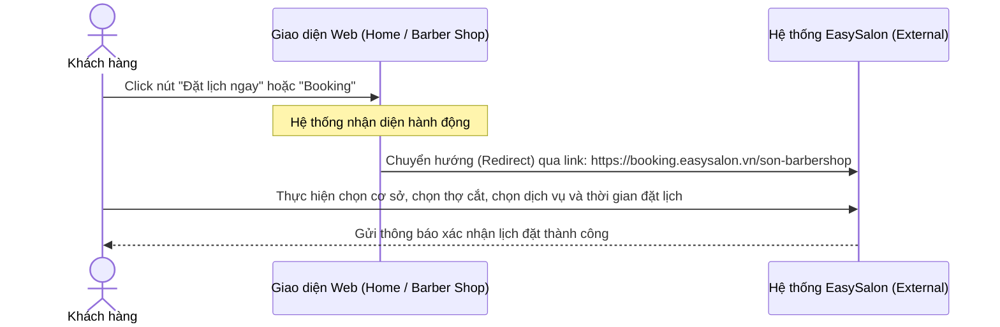
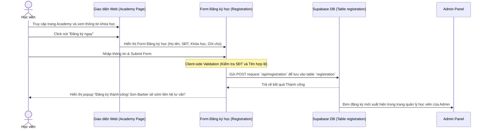
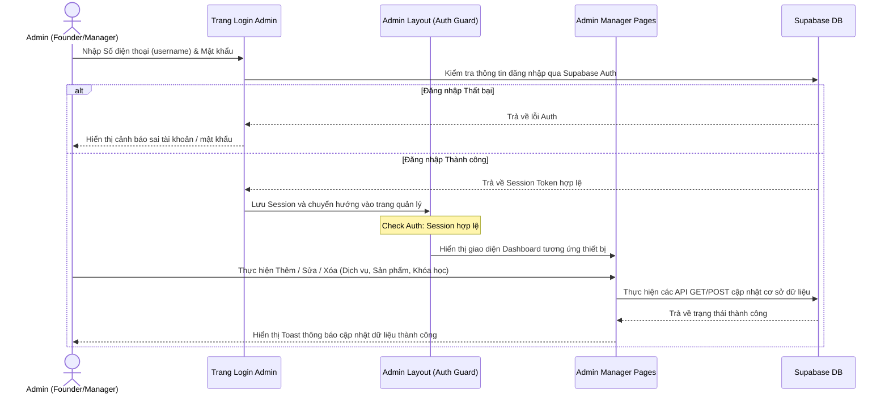

# 03. User Flows - SonBarber Website

Tài liệu này chi tiết hóa các luồng hành vi của người dùng trên website Sơn Barber.

---

## 1. Luồng Đặt lịch Cắt tóc (Booking Flow)
Khách hàng muốn đặt lịch hẹn làm tóc tại các cơ sở của Sơn Barber.

---

## 2. Luồng Đăng ký Học nghề (Academy Course Registration Flow)
Học viên tìm hiểu khóa học và gửi đơn đăng ký nhập học trực tuyến.

---

## 3. Luồng Quản trị của Admin (Admin Authentication & Management Flow)
Quản trị viên đăng nhập và thực hiện thao tác quản lý dữ liệu trên website.

